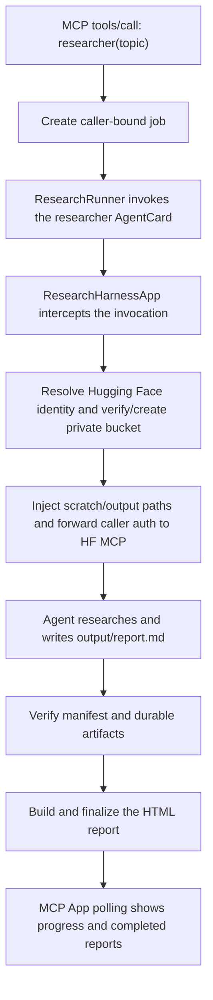

# Hugging Face Researcher

Hugging Face Researcher is an MCP App that uses an agent to conduct
research on the Hugging Face Hub.

It keeps reusable workings in a private per-user bucket, and produces
markdown and interactive HTML reports.

- Production Space: <https://huggingface.co/spaces/evalstate/researcher>
- MCP endpoint: <https://evalstate-researcher.hf.space/mcp>
- Public report examples: <https://evalstate-researcher-reports.hf.space>

## How it works

The application has three deliberately separate layers:

1. **Agent** — `research/agent-cards/researcher.md` defines the model,
   instructions, Hugging Face MCP server, and lifecycle hook.
2. **Harness** — `ResearchRunner` invokes that AgentCard through the
   protocol-neutral fast-agent Harness. `ResearchHarnessApp` wraps each
   invocation to prepare the authenticated user's durable workspace.
3. **MCP App** — `fastmcp_server.py` exposes the `researcher` MCP tool, starts a
   background job, and projects job state into the Prefab UI.



### The agent

`research/agent-cards/researcher.md` is an ordinary Agent named
`researcher`. It uses the Hugging Face MCP server and instructs the model to:

- prefer authoritative Hugging Face and primary sources;
- preserve reusable code, data, and charts under `scratch/research/`;
- write the sourced report to `output/report.md`;
- finish with a manifest that declares every durable artifact.

The model-visible MCP App entry point is defined separately:

```python
@app.ui(name="researcher", title="Hugging Face Researcher")
async def researcher(topic: str, ctx: MCPContext) -> PrefabApp:
    ...
```

An MCP App entry point is still a normal MCP tool. Apps-capable hosts render
its UI resource; ordinary MCP clients can invoke it through `tools/call`.
Supporting tools such as `research_status` and `cancel_research` are app-only
and are called by the rendered UI.

### The Harness invocation

`ResearchRunner.invoke()` is the essential fast-agent integration:

```python
with harness.request_context(auth=auth):
    async with harness.app().open(
        AppOpenRequest(
            session_id=job.harness_session_id,
            agent="researcher",
            metadata={"research_workspace_id": job.artifact_id},
        )
    ) as session:
        response = await session.invoke(
            AgentRequest.text(
                job.topic,
                agent="researcher",
                session_id=job.harness_session_id,
                auth=auth,
            )
        )
```

The configured `harness_app.entrypoint` wraps that invocation with
`ResearchHarnessApp`. Before the request reaches the model, the wrapper:

1. resolves the authoritative Hugging Face identity from caller auth;
2. verifies or creates the private `<username>/research-agent` bucket;
3. chooses a safe per-run workspace ID;
4. writes workspace markers;
5. optionally provisions the user's private report archive Space;
6. injects the verified `root`, `scratch`, and `output` paths into the request;
7. forwards the same caller bearer token to Hugging Face MCP tool calls.

The resulting workspace is:

```text
hf://buckets/<username>/research-agent/<run-id>/
├── scratch/
│   ├── .workspace.json
│   └── research/
└── output/
    ├── .keep
    ├── report.md
    └── report.html
```

If identity, bucket access, or marker creation fails, the Harness invocation
fails before the research model is called. These paths are Hugging Face bucket
paths, not directories on the Researcher Space filesystem.

### The activity hook

The Researcher AgentCard configures:

```yaml
tool_hooks:
  after_llm_call: ../activity_hooks.py:capture_after_llm
```

After each LLM step, this hook captures provider-exposed reasoning, visible
response text, and sanitized intended tool calls. It does not create the
workspace and it does not feed tool results back into the narrative.

`ActivityNarrator` periodically sends the captured batch and previous summary
to the separate no-tools `activity-summarizer` AgentCard using `$system.fast`.
The resulting short description powers the live “what the Researcher is doing”
display without changing or blocking the main research loop.

### Report generation

The main agent writes Markdown and a research manifest into the authenticated
bucket workspace. The runner verifies that handoff before presentation starts.

The HTML stage then:

1. mounts only the current bucket workspace into a short-lived Hugging Face
   Sandbox;
2. runs the vendored Birch HTML skill;
3. validates the presentation manifest and generated HTML;
4. embeds trusted styling and assets;
5. writes the final `output/report.html` back to the same private workspace.

Markdown remains available if HTML generation fails.

## Production server

The hosting space is started with:

```text
python fastmcp_research_app.py --host 0.0.0.0 --port 7860
```

`fastmcp_research_app.py` starts the custom FastMCP App server, which builds a
fast-agent Harness and registers the `researcher` UI tool directly.


### Run the production MCP App locally

```bash
uv run --with fast-agent-mcp \
  --with 'fastmcp[apps]==3.4.4' \
  --with 'prefab-ui==0.20.2' \
  --with huggingface_hub \
  --with pillow \
  python fastmcp_research_app.py \
  --host 127.0.0.1 \
  --port 8723
```

This is the local command closest to the deployed Space.

### Run the agent in the fast-agent TUI

Install the published CLI with `uv tool install fast-agent-mcp`, or activate an
environment that provides the `fast-agent` command. Then run:

```bash
fast-agent go \
  --home research \
  --agent-cards research/agent-cards \
  --agent researcher
```

This is useful for working on the AgentCard itself. To exercise the same
Harness wrapper and bucket preparation used by the MCP App, use:

```bash
uv run --with fast-agent-mcp python harness_chat.py
```

### Run one request

```bash
fast-agent go \
  --home research \
  --agent-cards research/agent-cards \
  --agent researcher \
  --message "Research current Hugging Face MCP capabilities and write a sourced report."
```

## Durable storage

### Per-user research bucket

Each authenticated user owns a private bucket:

```text
<username>/research-agent
```

Independent runs are stored beneath safe workspace IDs. The agent receives
only the current run's paths and uses Hugging Face MCP tools to work with them.
The production Harness does not expose the Space host shell or filesystem to
the model.

### Private report archive

After verifying the bucket, the Harness idempotently ensures a private
`<username>/research-agent` archive Space. New archives are duplicated from
`RESEARCH_ARCHIVE_TEMPLATE_SPACE` and mount the user's private bucket at
`/research`.

The provisioner:

- validates `archive-template.json` before creating or modifying a Space;
- refuses collisions with unmanaged Spaces;
- configures the bucket volume during duplication;
- reports version mismatches without silently overwriting older archives;
- treats archive provisioning as optional so it cannot prevent research.

### Private session traces

Completed, failed, and cancelled jobs export local Codex JSONL traces. In
production, the Space mounts a separate private bucket at the fast-agent
session directory so raw sessions and `research-traces/` remain durable without
an archive token in the app environment.

For deployments without a mounted trace bucket, explicit archiving is
available:

```bash
export RESEARCH_ARCHIVE_HF_URL=hf://buckets/<owner>/<private-trace-bucket>
export RESEARCH_ARCHIVE_TOKEN=hf_...
```

Use a dedicated fine-grained token with write access only to that private
bucket. Missing buckets are created private; existing public buckets are
rejected.

### Public report mirror

Public examples are copied from private storage into a separate public bucket.
The publication layer never moves or mutates source files and excludes scratch
work, traces, manifests, code, and unapproved data files.

Preview one report:

```bash
python scripts/publish_reports.py --run <run-id>
```

Publish it:

```bash
python scripts/publish_reports.py --run <run-id> --publish
```

The public archive mounts only the public bucket and does so read-only.

## Build and deploy

Build reproducible deployment contexts under ignored `.build/`:

```bash
python scripts/build_deploy.py
python scripts/build_deploy.py researcher
```

Deploy and monitor the production Space:

```bash
python scripts/deploy_spaces.py researcher --create
```

Deploy the data-free private archive template:

```bash
python scripts/deploy_spaces.py research-archive-template --create
```

Deploy the public report archive:

```bash
python scripts/deploy_spaces.py researcher-reports
```

Its initial Space, read-only bucket mount, and environment configuration are
provisioned by `scripts/publish_reports.py --publish`.

Never edit generated `.build/` files. Update canonical sources under
`research/` or deployment-specific files under `deploy/`, then rebuild.

## Preview the UI

Render real component trees with static states and local Chrome:

```bash
uv run --with fast-agent-mcp \
  --with 'fastmcp[apps]==3.4.4' \
  --with 'prefab-ui==0.20.2' \
  --with pillow \
  python scripts/render_app_preview.py --state all
```

Generated HTML and screenshots are written under `.artifacts/app-preview/`.
Preview mode does not require MCP, OAuth, or bucket access.

Render the Hugging Face design packs:

```bash
uv run --with fast-agent-mcp \
  --with 'fastmcp[apps]==3.4.4' \
  --with 'prefab-ui==0.20.2' \
  --with pillow \
  python scripts/render_design_packs.py
```

## Tests

The CI suite covers Harness invocation, authentication, workspace isolation,
artifact contracts, MCP App behavior, archive provisioning, UI rendering,
deployment contexts, and public report publication:

```bash
pytest -q
python scripts/build_deploy.py --output .build/ci-deploy
```
